# Azure-project4
# Joeri Vlieghe


Project 4 for azure data engineering - data pipelines for NYC payroll

### Project description
The City of New York would like to develop a Data Analytics platform on Azure Synapse Analytics to accomplish two primary objectives:

Analyze how the City's financial resources are allocated and how much of the City's budget is being devoted to overtime.
Make the data available to the interested public to show how the City’s budget is being spent on salary and overtime pay for all municipal employees.
You have been hired as a Data Engineer to create high-quality data pipelines that are dynamic, can be automated, and monitored for efficient operation. The project team also includes the city’s quality assurance experts who will test the pipelines to find any errors and improve overall data quality.

The source data resides in Azure Data Lake and needs to be processed in a NYC data warehouse in Azure Synapse Analytics. The source datasets consist of CSV files with Employee master data and monthly payroll data entered by various City agencies.


# Tasks

## Task 1 : Create and Configure Resources

### Step 1: Prepare the Data Infrastructure

  Setup Data and Resources in Azure

#### 1. Create the data lake and upload data

I created a storage account and made sure to select "hierarchical namespace" to make it a gen2 data lake.
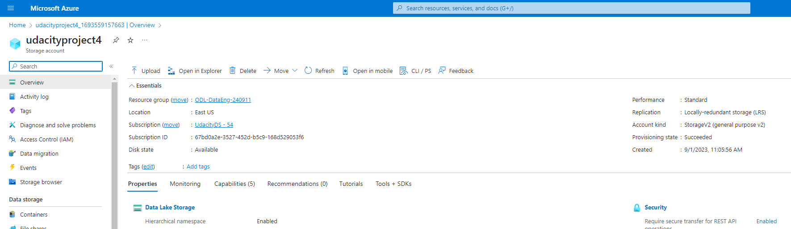

Next I uploaded the .csv files provided to the respective folders:

- dirpayrollfiles
- dirhistoryfiles
- dirstaging

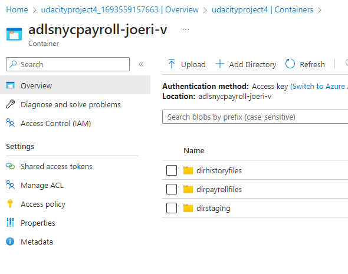

Upload these files from the project data to the dirpayrollfiles folder

- EmpMaster.csv
- AgencyMaster.csv
- TitleMaster.csv
- nycpayroll_2021.csv
  
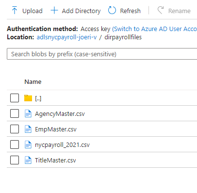

Upload this file (historical data) from the project data to the dirhistoryfiles folder

nycpayroll_2020.csv

#### 2. Create an Azure Data Factory Resource

I configured and created the data factory resource:

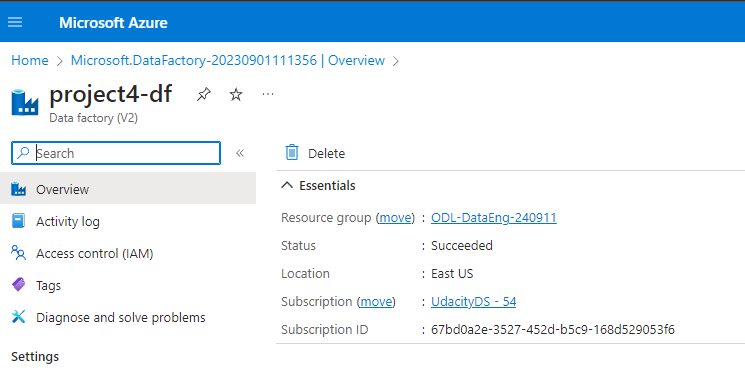

#### 3. Create a SQL Database to store the current year of the payroll data

In the Azure portal, create a SQL Database resource named db_nycpayroll

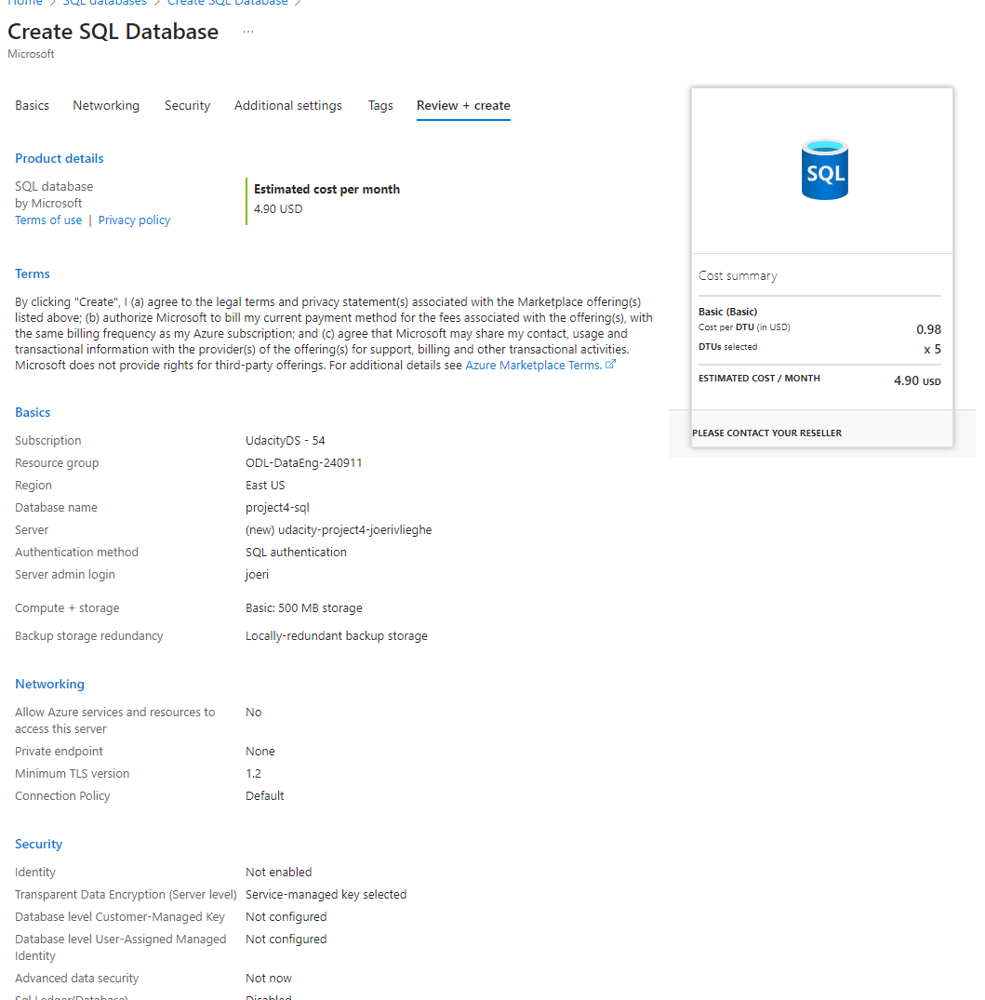

Add client IP address to the SQL DB firewall

Create a table called NYC_Payroll_Data in db_nycpayroll in the Azure Query Editor with this SQL Script:

```
CREATE TABLE [dbo].[NYC_Payroll_Data](
    [FiscalYear] [int] NULL,
    [PayrollNumber] [int] NULL,
    [AgencyID] [varchar](10) NULL,
    [AgencyName] [varchar](50) NULL,
    [EmployeeID] [varchar](10) NULL,
    [LastName] [varchar](20) NULL,
    [FirstName] [varchar](20) NULL,
    [AgencyStartDate] [date] NULL,
    [WorkLocationBorough] [varchar](50) NULL,
    [TitleCode] [varchar](10) NULL,
    [TitleDescription] [varchar](100) NULL,
    [LeaveStatusasofJune30] [varchar](50) NULL,
    [BaseSalary] [float] NULL,
    [PayBasis] [varchar](50) NULL,
    [RegularHours] [float] NULL,
    [RegularGrossPaid] [float] NULL,
    [OTHours] [float] NULL,
    [TotalOTPaid] [float] NULL,
    [TotalOtherPay] [float] NULL
)

GO
```
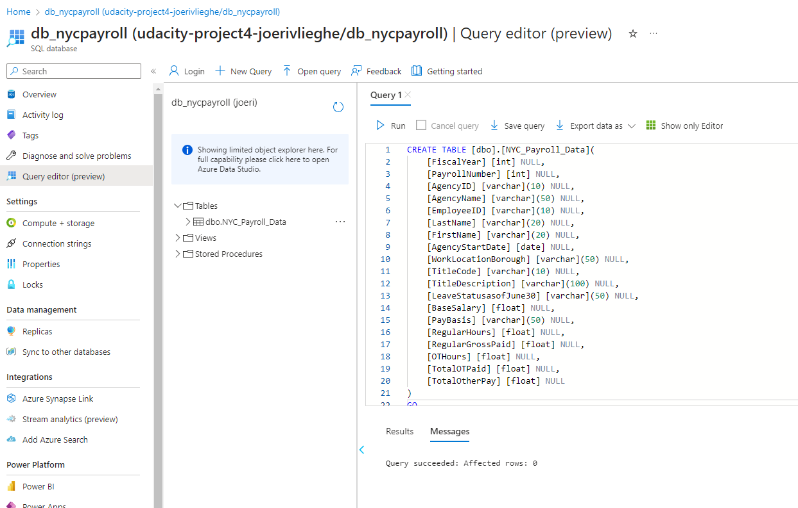

#### 4. Create a Synapse Analytics workspace

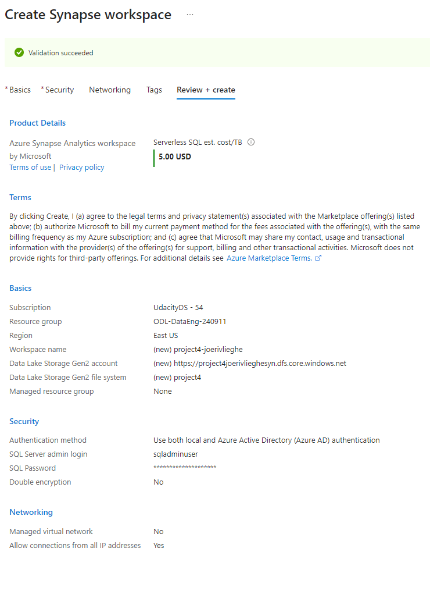

#### 5. Create master data tables and payroll transaction tables in Synapse Analytics workspace

I have created multiple sql scripts to create the necessary external file format, data sources and external tables.

Note: I have added the necessary credentials to ensure I can use the managed identity for the data factory linked service / dataset.

Ref : https://www.madeiradata.com/post/external-tables-with-sql-user
https://sqlkover.com/read-data-from-azure-synapse-serverless-sql-pools-with-azure-data-factory/

```
USE master
CREATE login somename WITH PASSWORD =  '********'

USE [udacity-serverless]
CREATE USER somename FOR LOGIN somename

ALTER ROLE [db_datareader] ADD MEMBER [somename]
```
```
-- 1.create a master key
CREATE MASTER KEY ENCRYPTION BY PASSWORD ='*******'

-- 2.create a database credential
CREATE DATABASE SCOPED CREDENTIAL myCred
WITH IDENTITY = 'Managed Identity'

--3.Give the user permissions to the credential
GRANT REFERENCES     
    ON DATABASE SCOPED CREDENTIAL :: myCred  
    TO [somename]
```
```
GRANT REFERENCES ON CREDENTIAL::[myCred] TO [jvudacitydatafact];
```
```
IF NOT EXISTS (SELECT * FROM sys.external_file_formats WHERE name = 'SynapseDelimitedTextFormat') 
	CREATE EXTERNAL FILE FORMAT [SynapseDelimitedTextFormat] 
	WITH ( FORMAT_TYPE = DELIMITEDTEXT ,
	       FORMAT_OPTIONS (
			 FIELD_TERMINATOR = ',',
			 FIRST_ROW = 2,
			 USE_TYPE_DEFAULT = FALSE
			))
GO

IF NOT EXISTS (SELECT * FROM sys.external_data_sources WHERE name = 'adlsnycpayroll-joeri-v_udacityjvstorageacc_dfs_core_windows_net') 
	CREATE EXTERNAL DATA SOURCE [adlsnycpayroll-joeri-v_udacityjvstorageacc_dfs_core_windows_net] 
	WITH (
		LOCATION = 'abfss://adlsnycpayroll-joeri-v@udacityjvstorageacc.dfs.core.windows.net',
		CREDENTIAL = [mycred] 
	)
GO

CREATE EXTERNAL TABLE [dbo].[EmpMaster] (
	[EmployeeID] nvarchar(10),
	[LastName] nvarchar(4000),
	[FirstName] nvarchar(4000)
	)
	WITH (
	LOCATION = 'dirpayrollfiles/EmpMaster.csv',
	DATA_SOURCE = [adlsnycpayroll-joeri-v_udacityjvstorageacc_dfs_core_windows_net],
	FILE_FORMAT = [SynapseDelimitedTextFormat]
	)
GO
```

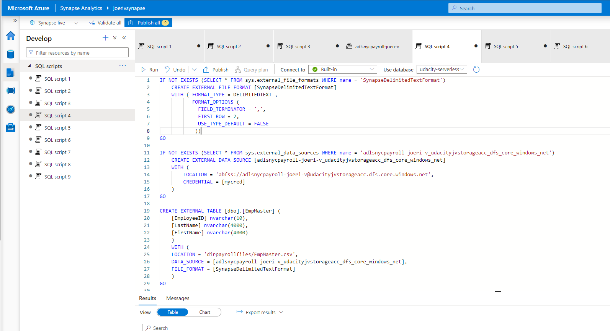

## Task 2 : Create Linked Services

#### 1. Create a Linked Service for Azure Data Lake

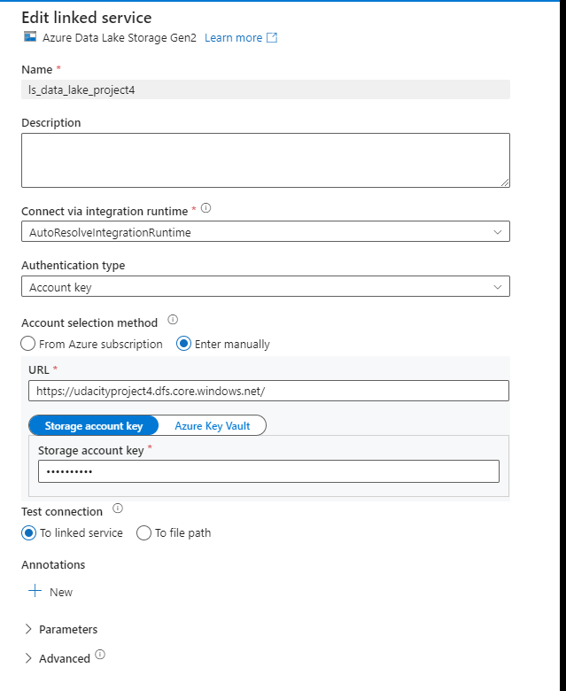

#### 2. Create a Linked Service to SQL Database that has the current (2021) data

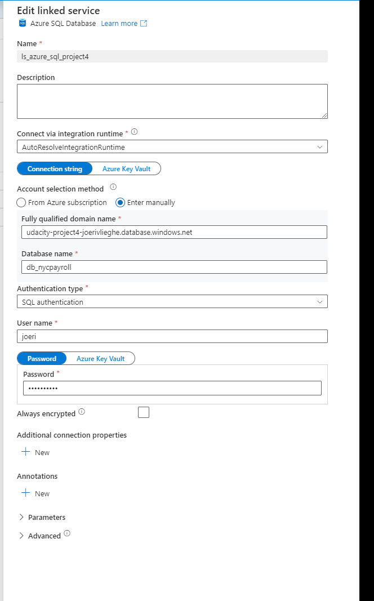

#### 3. Create a Linked Service for Synapse Analytics
  I have assigned the "Managed identity name" for this and had to manually select the domain name for Synapse. See screenshot

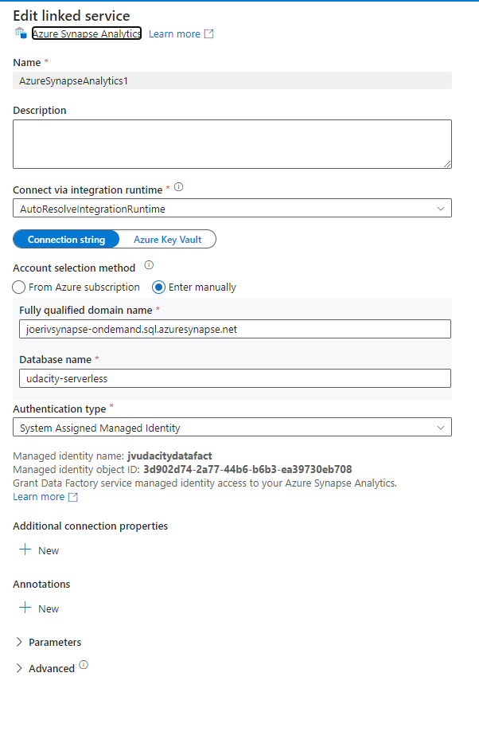

## Task 3 : Create Datasets

#### 1. Create the datasets for the 2021 Payroll file on Azure Data Lake Gen2

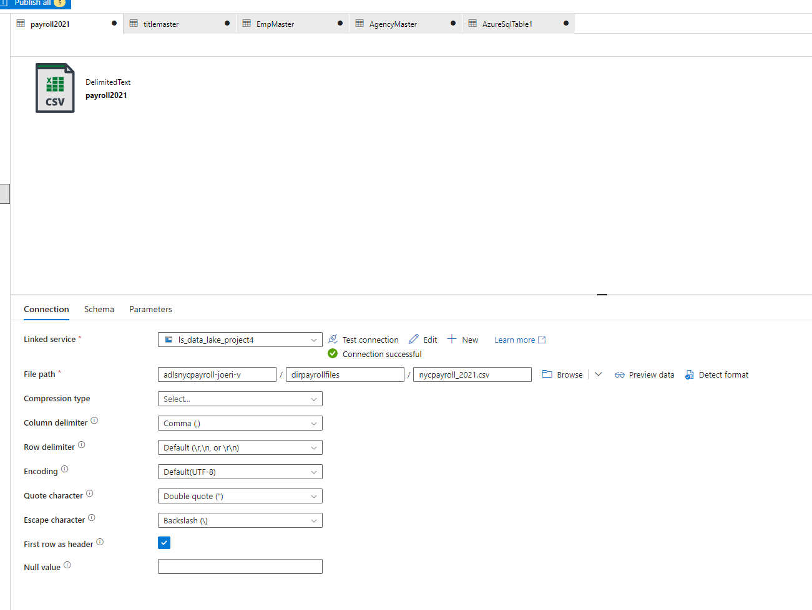

#### 2. Repeat the same process to create datasets for the rest of the data files in the Data Lake

#### 3. Create the dataset for transaction data table that should contain current (2021) data in SQL DB

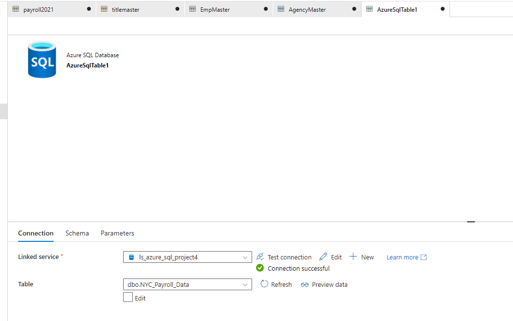

#### 4. Create the datasets for destination (target) tables in Synapse Analytics

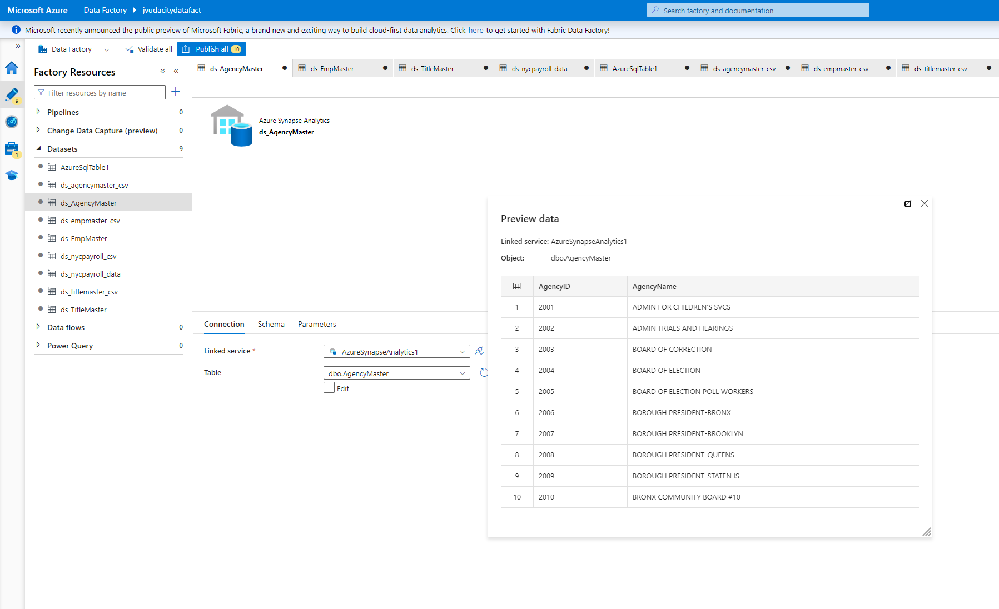


