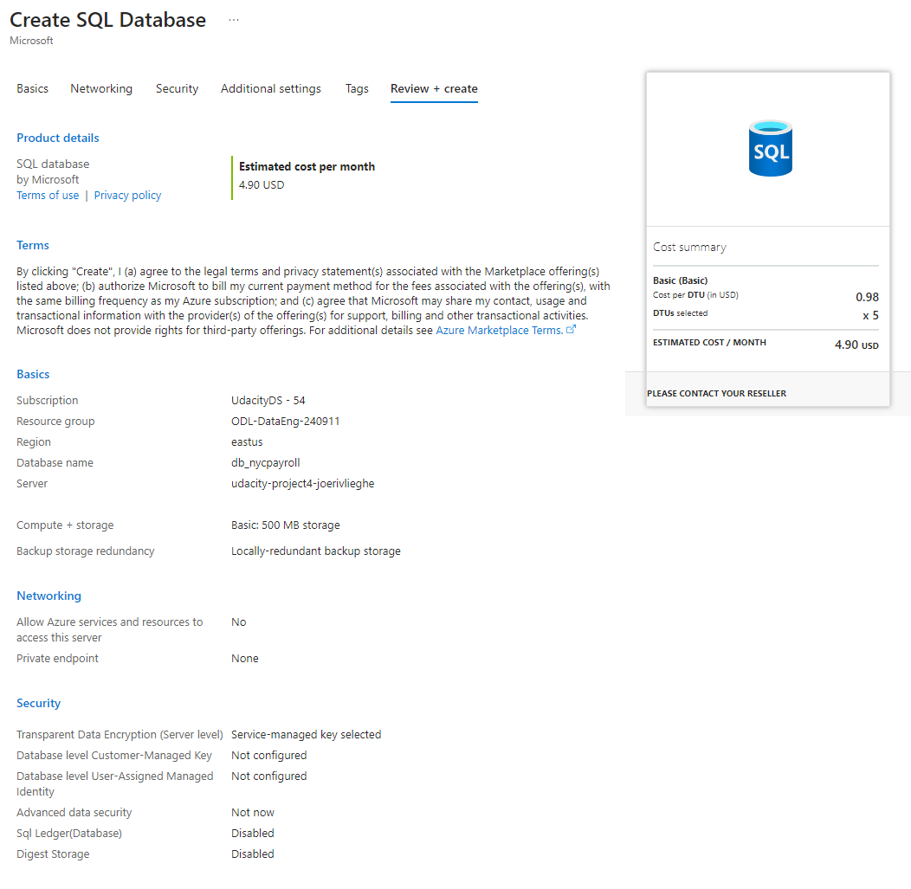

# Azure-project4
# Joeri Vlieghe


Project 4 for azure data engineering - data pipelines for NYC payroll

### Project description
The City of New York would like to develop a Data Analytics platform on Azure Synapse Analytics to accomplish two primary objectives:

Analyze how the City's financial resources are allocated and how much of the City's budget is being devoted to overtime.
Make the data available to the interested public to show how the City’s budget is being spent on salary and overtime pay for all municipal employees.
You have been hired as a Data Engineer to create high-quality data pipelines that are dynamic, can be automated, and monitored for efficient operation. The project team also includes the city’s quality assurance experts who will test the pipelines to find any errors and improve overall data quality.

The source data resides in Azure Data Lake and needs to be processed in a NYC data warehouse in Azure Synapse Analytics. The source datasets consist of CSV files with Employee master data and monthly payroll data entered by various City agencies.


# Tasks

## Task 1 : Create and Configure Resources

### Step 1: Prepare the Data Infrastructure

  Setup Data and Resources in Azure

#### 1. Create the data lake and upload data

I created a storage account and made sure to select "hierarchical namespace" to make it a gen2 data lake.


Next I uploaded the .csv files provided to the respective folders:

- dirpayrollfiles
- dirhistoryfiles
- dirstaging


Upload these files from the project data to the dirpayrollfiles folder

- EmpMaster.csv
- AgencyMaster.csv
- TitleMaster.csv
- nycpayroll_2021.csv
  


Upload this file (historical data) from the project data to the dirhistoryfiles folder

nycpayroll_2020.csv

#### 2. Create an Azure Data Factory Resource

I configured and created the data factory resource:


#### 3. Create a SQL Database to store the current year of the payroll data

In the Azure portal, create a SQL Database resource named db_nycpayroll



Add client IP address to the SQL DB firewall

Create a table called NYC_Payroll_Data in db_nycpayroll in the Azure Query Editor with this SQL Script:

```
CREATE TABLE [dbo].[NYC_Payroll_Data](
    [FiscalYear] [int] NULL,
    [PayrollNumber] [int] NULL,
    [AgencyID] [varchar](10) NULL,
    [AgencyName] [varchar](50) NULL,
    [EmployeeID] [varchar](10) NULL,
    [LastName] [varchar](20) NULL,
    [FirstName] [varchar](20) NULL,
    [AgencyStartDate] [date] NULL,
    [WorkLocationBorough] [varchar](50) NULL,
    [TitleCode] [varchar](10) NULL,
    [TitleDescription] [varchar](100) NULL,
    [LeaveStatusasofJune30] [varchar](50) NULL,
    [BaseSalary] [float] NULL,
    [PayBasis] [varchar](50) NULL,
    [RegularHours] [float] NULL,
    [RegularGrossPaid] [float] NULL,
    [OTHours] [float] NULL,
    [TotalOTPaid] [float] NULL,
    [TotalOtherPay] [float] NULL
)

GO
```


#### 4. Create a Synapse Analytics workspace


#### 5. Create master data tables and payroll transaction tables in Synapse Analytics workspace

I have created multiple sql scripts to create the necessary external file format, data sources and external tables.

Note: I have added the necessary credentials to ensure I can use the managed identity for the data factory linked service / dataset.

Ref : https://www.madeiradata.com/post/external-tables-with-sql-user
https://sqlkover.com/read-data-from-azure-synapse-serverless-sql-pools-with-azure-data-factory/

```
USE master
CREATE login somename WITH PASSWORD =  '********'

USE [udacity-serverless]
CREATE USER somename FOR LOGIN somename

ALTER ROLE [db_datareader] ADD MEMBER [somename]
```
```
-- 1.create a master key
CREATE MASTER KEY ENCRYPTION BY PASSWORD ='*******'

-- 2.create a database credential
CREATE DATABASE SCOPED CREDENTIAL myCred
WITH IDENTITY = 'Managed Identity'

--3.Give the user permissions to the credential
GRANT REFERENCES     
    ON DATABASE SCOPED CREDENTIAL :: myCred  
    TO [somename]
```
```
GRANT REFERENCES ON CREDENTIAL::[myCred] TO [jvudacitydatafact];
```
```
IF NOT EXISTS (SELECT * FROM sys.external_file_formats WHERE name = 'SynapseDelimitedTextFormat') 
	CREATE EXTERNAL FILE FORMAT [SynapseDelimitedTextFormat] 
	WITH ( FORMAT_TYPE = DELIMITEDTEXT ,
	       FORMAT_OPTIONS (
			 FIELD_TERMINATOR = ',',
			 FIRST_ROW = 2,
			 USE_TYPE_DEFAULT = FALSE
			))
GO

IF NOT EXISTS (SELECT * FROM sys.external_data_sources WHERE name = 'adlsnycpayroll-joeri-v_udacityjvstorageacc_dfs_core_windows_net') 
	CREATE EXTERNAL DATA SOURCE [adlsnycpayroll-joeri-v_udacityjvstorageacc_dfs_core_windows_net] 
	WITH (
		LOCATION = 'abfss://adlsnycpayroll-joeri-v@udacityjvstorageacc.dfs.core.windows.net',
		CREDENTIAL = [mycred] 
	)
GO

CREATE EXTERNAL TABLE [dbo].[EmpMaster] (
	[EmployeeID] nvarchar(10),
	[LastName] nvarchar(4000),
	[FirstName] nvarchar(4000)
	)
	WITH (
	LOCATION = 'dirpayrollfiles/EmpMaster.csv',
	DATA_SOURCE = [adlsnycpayroll-joeri-v_udacityjvstorageacc_dfs_core_windows_net],
	FILE_FORMAT = [SynapseDelimitedTextFormat]
	)
GO
```


## Task 2 : Create Linked Services

#### 1. Create a Linked Service for Azure Data Lake


#### 2. Create a Linked Service to SQL Database that has the current (2021) data


#### 3. Create a Linked Service for Synapse Analytics
  I have assigned the "Managed identity name" for this and had to manually select the domain name for Synapse. See screenshot


## Task 3 : Create Datasets

#### 1. Create the datasets for the 2021 Payroll file on Azure Data Lake Gen2


#### 2. Repeat the same process to create datasets for the rest of the data files in the Data Lake

#### 3. Create the dataset for transaction data table that should contain current (2021) data in SQL DB


#### 4. Create the datasets for destination (target) tables in Synapse Analytics


## Task 4 : Create Data Flows

#### 1. In Azure Data Factory, create the data flow to load 2021 Payroll Data to SQL DB transaction table (in the future NYC will load all the transaction data into this table).


#### 2. Create Pipeline to load 2021 Payroll data into transaction table in the SQL DB


After manually triggering the pipeline this is the result:

- The pipeline has run succesfully:
- 

- The data is loaded into the SQL database:
- 

#### 3. Create data flows to load the data from the data lake files into the Synapse Analytics data tables

3 data flows were created for this: 
- df_titlemaster_csv_to_synapse
- df_empmaster_csv_to_synapse
- df_agencymaster_csv_to_synapse


#### 4. Create a data flow to load 2021 data from SQL DB to Synapse Analytics


#### 5. Create pipelines for Employee, Title, Agency, and year 2021 Payroll transaction data to Synapse Analytics containing the data flows.

I created 4 pipelines for this:
- pipeline_agencymaster_csv_to_synapse
- pipeline_empmaster_csv_to_synapse
- pipeline_titlemaster_csv_to_synapse
- pipeline_payroll_sql_to_synapse

All 4 pipelines did not run. The reason for this is that the project rubric expects this to run on SQL dedicated in Synapse. In Synapse I have created external tables which already load in the data from the CSV files, so the step using dataflow and pipeline to sink the CSV data into the database table is not necessary.

```
Operation on target Data flow1 failed: {"StatusCode":"DF-SQLDW-IncorrectLinkedServiceConfiguration","Message":"Job failed due to reason: at Sink 'sink1': The linked service is incorrectly configured as type 'Azure Synapse Analytics' instead of 'Azure SQL Database'. Please create a new linked service of type 'Azure SQL Database' \n Note: Please check that the given database is of type 'Dedicated SQL pool (formerly SQL DW)' for linked service type 'Azure Synapse Analytics'. ","Details":"shaded.msdataflow.com.microsoft.sqlserver.jdbc.SQLServerException: Incorrect syntax near 'HEAP'.\n\tat shaded.msdataflow.com.microsoft.sqlserver.jdbc.SQLServerException.makeFromDatabaseError(SQLServerException.java:265)\n\tat shaded.msdataflow.com.microsoft.sqlserver.jdbc.SQLServerStatement.getNextResult(SQLServerStatement.java:1673)\n\tat shaded.msdataflow.com.microsoft.sqlserver.jdbc.SQLServerStatement.doExecuteStatement(SQLServerStatement.java:907)\n\tat shaded.msdataflow.com.microsoft.sqlserver.jdbc.SQLServerStatement$StmtExecCmd.doExecute(SQLServerStatement.java:802)\n\tat shaded.msdataflow.com.microsoft.sqlserver.jdbc.TDSCommand.execute(IOBuffer.java:7627)\n\tat shaded.msdataflow.com.microsoft.sqlserver.jdbc.SQLServerConnection.executeCommand(SQLServerConnection.java:3912)\n\tat shaded.msdataflow.com.microsoft.sqlserver.jdbc.SQLServerStatement.executeCommand(SQLServerStatement.java:268)\n\tat shaded.msdataflow.com.microsoft.sqlserver.jdbc.SQLServerStatement.executeStatement(SQLServerStatement.java:242)\n\tat shaded.msdat"}
```


## Task 5 : Data Aggregation and Parameterization

#### 1.Create a Summary table in Synapse with the following SQL script and create a dataset named table_synapse_nycpayroll_summary

Since I do not have a dedicated SQL server on the Synapse platform, I have chosen to create the table on the Azure SQL database.


#### 2.Create a new dataset for the Azure Data Lake Gen2 folder that contains the historical files.


#### 3.Create new data flow and name it Dataflow Aggregate Data
- Create a data flow level parameter for Fiscal Year
- Add first Source for table_sqldb_nyc_payroll_data table
- Add second Source for the Azure Data Lake history folder
#### 4.Create a new Union activity in the data flow and Union with history files

#### 5.Add a Filter activity after Union

In Expression Builder, enter toInteger(FiscalYear) >= $dataflow_param_fiscalyear
#### 6.Derive a new TotalPaid column

In Expression Builder, enter RegularGrossPaid + TotalOTPaid+TotalOtherPay
#### 7.Add an Aggregate activity to the data flow next to the TotalPaid activity

Under Group By, Select AgencyName and Fiscal Year
#### 8.Add a Sink activity to the Data Flow

Select the dataset to target (sink) the data into the Synapse Analytics Payroll Summary table.
In Settings, select Truncate Table

Following all these steps, the dataflow was created:


#### 9.Create a new Pipeline and add the Aggregate data flow

Create a new Global Parameter (This will be the Parameter at the global pipeline level that will be passed on to the data flow
In Parameters, select Pipeline Expression
Choose the parameter created at the Pipeline level


#### 10.Validate, Publish and Trigger the pipeline. Enter the desired value for the parameter.

#### 11.Monitor the Pipeline run and take a screenshot of the finished pipeline run.

The global parameter was set to fiscal year 2020. Since the filter expression evaluates on >= it will show the totalpaid for 2020 and 2021.

Pipeline run finished succesfully:


The data in the SQL summary table looks OK:

